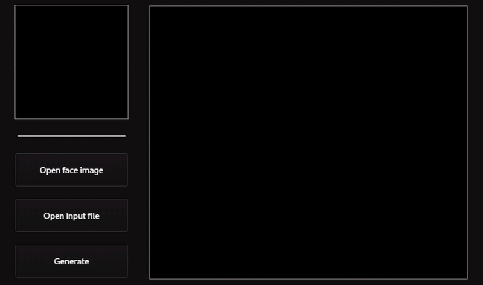

<h1 align="center">
    Deepfake-Dlib
</h1>

&nbsp;&nbsp;&nbsp;&nbsp;

<div align="center">
  <kbd>
    
  </kbd>
</div>

&nbsp;&nbsp;&nbsp;&nbsp;

<p align="center">
    An application that allows you to generate deepfake face images. This application uses Dlib's frontal_face detection functionality and combines it with their 68 point face landmark predictor to map out the shape. Afterwards a delaunay triangulation of these landmarks is calculated which are warped using affine transformation. To better blend the result image the application uses opencv seamless clone to remove some but not all gap imperfections.
</p>

## How to run application

### First intall all pip requirements

```bash
pip3 install -r requirements.txt
```

### Run src/main.py

```bash
python3 src/main.py
```
